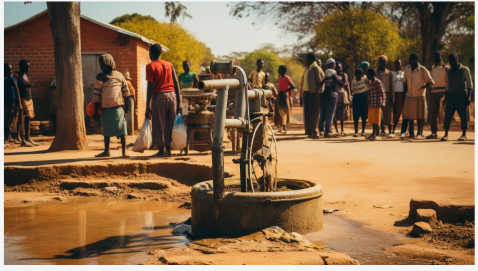
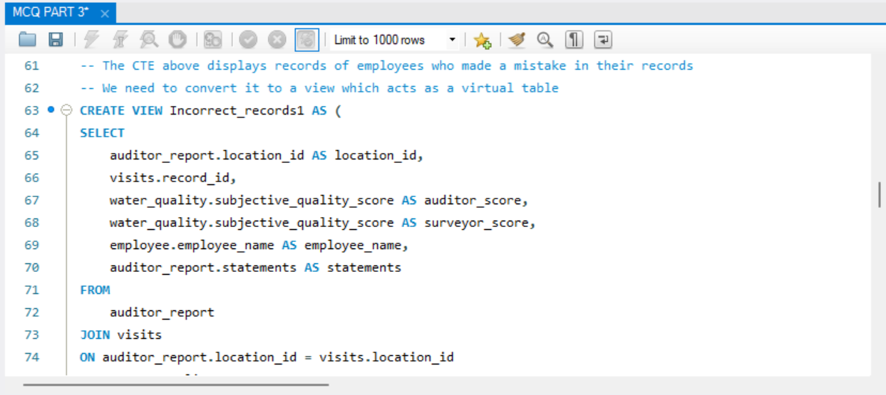
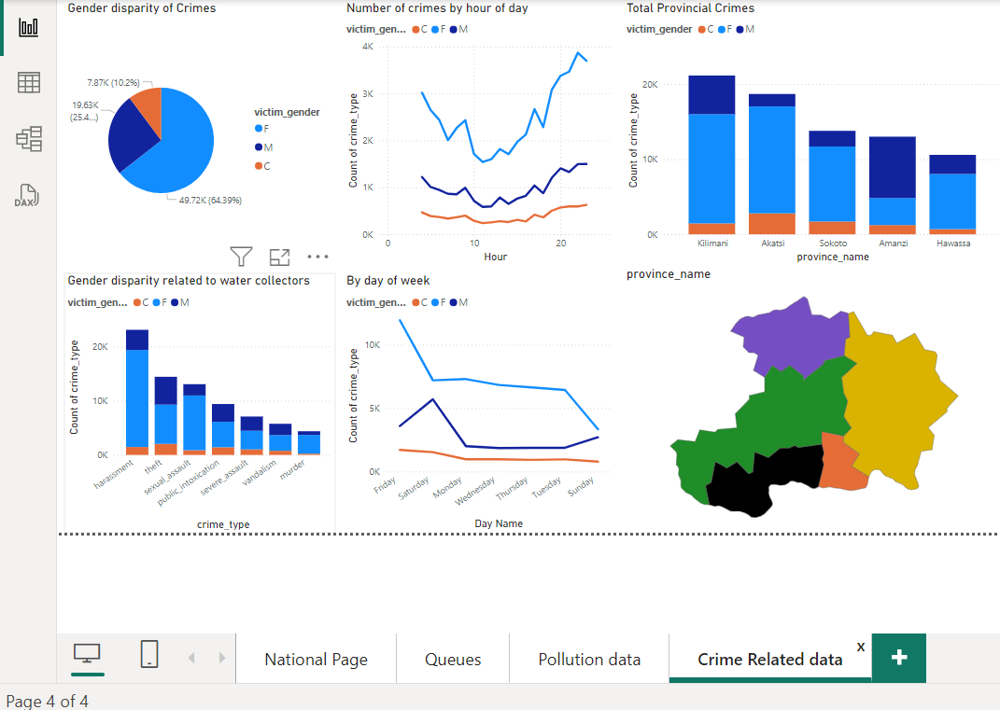

# A-MAJINDOGO-CAUSE
A FOCUS ON SDG 6: CLEAN WATER AND SANITATION 

# This project extensivily covers the water-crisis in Majindogo Community.
With a database with over 60000 records, we get to understand some of the underlying issues in the community and help curate solutions to this action

# QUERYING DATA

PARTS AND STEPS

PART 1
1. UNDERSTANDING THE DATA
2. DIVING INTO SOURCES
3. UNPACK VISITS
4. WATER SOURCE QUALITY
5. POLLUTION ISSUES

PART 2
1. CLEANING DATA
2. HONORING WORKERS
3. ANALYZING LOCATIONS
4. DIVING INTO SOURCES
5. START OF SOLUTION
6. ANALYSE QUEUES
7. REPORTING INSIGHTS

As of Part 2:
Water Accessibility and infrastructure summary report
This survey aimed to identify the water sources people use and determine both the total and average number of users for each source.
Additionally, it examined the duration citizens typically spend in queues to access water.
So let's create a short summary report we can send off to Pres. Naledi:

Insights
1. Most water sources are rural.
2. 43% of our people are using shared taps. 2000 people often share one tap.
3. 31% of our population has water infrastructure in their homes, but within that group, 45% face non-functional systems due to issues with pipes,
pumps, and reservoirs.
4. 18% of our people are using wells of which, but within that, only 28% are clean..
5. Our citizens often face long wait times for water, averaging more than 120 minutes.
6. In terms of queues:
- Queues are very long on Saturdays.
- Queues are longer in the mornings and evenings.
- Wednesdays and Sundays have the shortest queues.

Practical solutions
1. If communities are using rivers, we can dispatch trucks to those regions to provide water temporarily in the short term, while we send out
crews to drill for wells, providing a more permanent solution.
2. If communities are using wells, we can install filters to purify the water. For wells with biological contamination, we can install UV filters that
kill microorganisms, and for *polluted wells*, we can install reverse osmosis filters. In the long term, we need to figure out why these sources
are polluted.
3. For shared taps, in the short term, we can send additional water tankers to the busiest taps, on the busiest days. We can use the queue time
pivot table we made to send tankers at the busiest times. Meanwhile, we can start the work on installing extra taps where they are needed.
According to UN standards, the maximum acceptable wait time for water is 30 minutes. With this in mind, our aim is to install taps to get
queue times below 30 min.
4. Shared taps with short queue times (< 30 min) represent a logistical challenge to further reduce waiting times. The most effective solution,
installing taps in homes, is resource-intensive and better suited as a long-term goal.
5. Addressing broken infrastructure offers a significant impact even with just a single intervention. It is expensive to fix, but so many people
can benefit from repairing one facility. For example, fixing a reservoir or pipe that multiple taps are connected to. We will have to find the
commonly affected areas though to see where the problem actually is.

PART 3
1. GENERATING AN ERD
2. INTEGRATING THE REPORT
3. LINKING THE RECORDS
4. GATHERING EVIDENCE

PART 4
1. JOINING PIECES TOGETHER
2. LAST ANALYSIS
3. SUMMARY REPORT

# VISUALISING DATA
PARTS AND STEPS

PART 1
1. IMPORTING DATA
2. VISUAL ANALYSIS
3. MAPPING OUR DATA
4. WATER COLLECTION
5. CRIME AND WATER

PART 2
1. BUILD A DATA MODEL
2. NATIONAL SCALE
3. VISUALISE QUEUES
4. CLEANING UP WELLS
5. CONNECTING CRIME

As of Part 2, Some of the trends are:
1. AS water collectors, women are twice as likely to be a victim of crime than men
2. Women are likely to be victims of harrasment, followed by sexual assault
3. Crime spikes over weekend, and almost twice as many crimes are committed early in the morning or at night with women facing the greatest threat
4. In Amanzi, women face significantly less risk of being crime victims.

   

